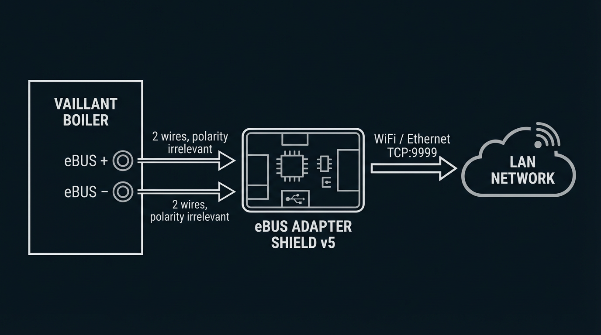
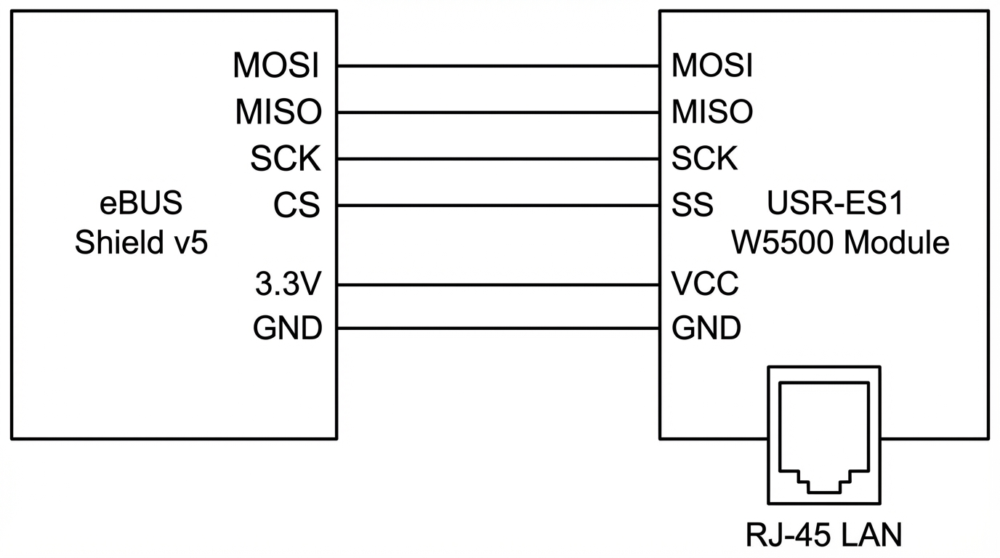
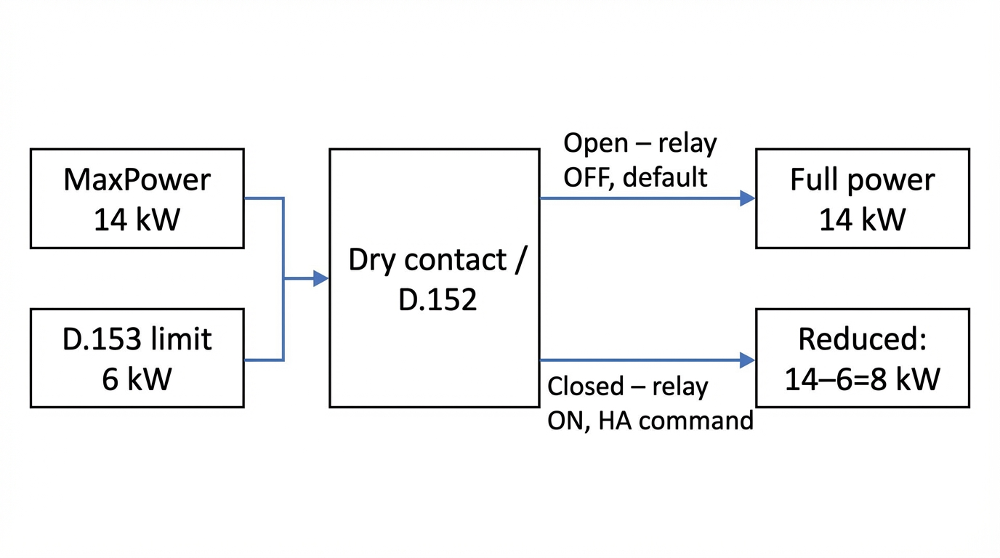
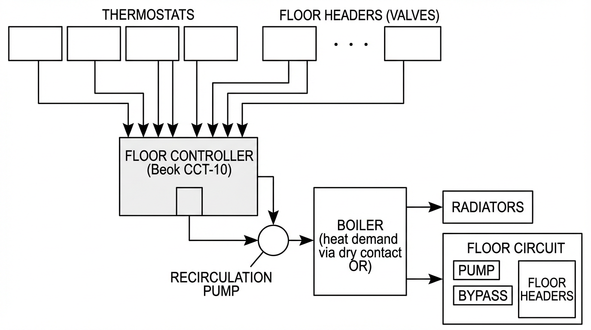
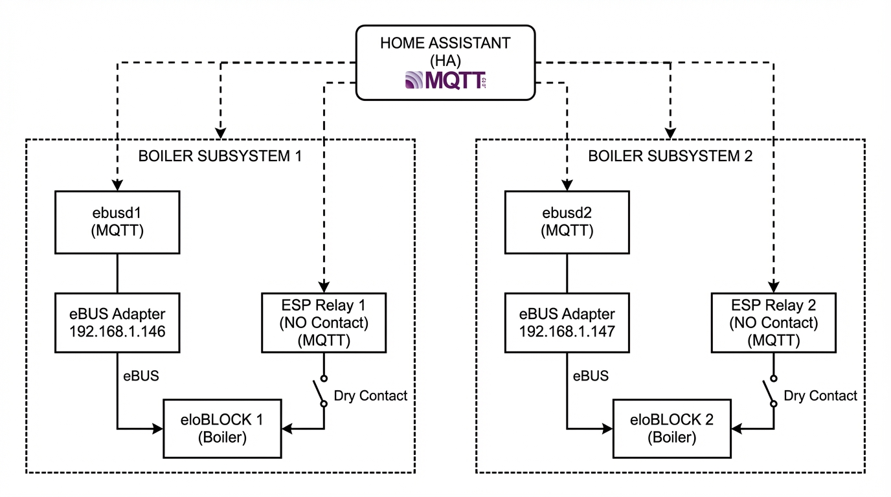

# Vaillant eloBLOCK и atmoTEC в умном доме: интеграция через eBUS, ebusd и Home Assistant

> **Аннотация:** Подробное руководство по подключению котлов Vaillant (электрического eloBLOCK и газового atmoTEC) к Home Assistant через протокол eBUS, демон ebusd и MQTT. Разбираем аппаратную часть, конфигурационные файлы, управление мощностью и автоматизацию отопления.

**Кому подойдёт:** тем, у кого уже стоит Vaillant eloBLOCK или atmoTEC и есть Home Assistant (или планируется). Пригодятся базовое понимание Docker, MQTT и умение подключать провода по схеме. Весь код и конфиги — в [репозитории на GitHub](https://github.com/Gfermoto/Vaillant).

---

## Зачем всё это нужно?

Современные котлы Vaillant оснащены цифровой шиной **eBUS** — проприетарным протоколом Vaillant Group, позволяющим обмениваться данными между котлом, терморегуляторами и внешними системами. По этой шине можно не только читать десятки параметров (температуры, давление, ступени мощности, часы наработки), но и записывать настройки — менять уставки температуры, включать/выключать режимы.

**Что даёт интеграция с умным домом:**

- Мониторинг в реальном времени: температура теплоносителя, давление в системе, потребляемая мощность
- Графики потребления энергии в Home Assistant Energy Dashboard
- Управление расписанием отопления через автоматизации
- Ограничение потребляемой мощности при пиковой нагрузке
- Push-уведомления при ошибках и аварийных ситуациях
- Экономия на отоплении: ночной нагрев по дешёвому тарифу

---

## Архитектура решения

**Компоненты:**

| Компонент | Назначение | Вариант |
|-----------|-----------|---------|
| **eBUS Adapter** | Физическое подключение к шине | Shield v5, v5-c6 |
| **USR-ES1** | Ethernet-модуль для адаптера | Опционально |
| **ebusd** | Демон для декодирования eBUS | Docker / Home Assistant addon |
| **MQTT broker** | Шина сообщений | Mosquitto |
| **Home Assistant** | Умный дом | HAOS / Docker |

---

## Аппаратная часть: адаптер eBUS

### Выбор адаптера

Рекомендуемый вариант — **[eBUS Adapter Shield v5](https://adapter.ebusd.eu/v5/index.en.html)** (или v5-c6). Это компактная плата (37×26 мм) с:
- Полной гальванической изоляцией
- Нулевым потреблением от шины eBUS
- Поддержкой WiFi (встроенная антенна), USB, GPIO и Ethernet
- OTA-обновлением прошивки

> 💡 **Почему v5?** В отличие от USB-адаптеров, сетевое подключение (WiFi/Ethernet) устраняет задержки USB-драйверов и джиттер, критичные для синхронизации на eBUS.

### Подключение к котлу

Шина eBUS — это два провода, полярность **не имеет значения**. Подключаться можно в любой точке цепи параллельно другим устройствам (термостатам, модулям расширения).

### Модуль USR-ES1 (опционально)

Для подключения Shield v5 по Ethernet используется модуль **USR-ES1** (W5500-совместимый). Он снижает задержки по сравнению с WiFi, что особенно важно при нестабильном WiFi-соединении.

**Схема подключения USR-ES1 к Shield v5:**

---

## Установка и настройка ebusd

**Вариант 1: Docker Compose (рекомендуется)**  
Полный пример с переменными окружения (адрес адаптера, MQTT, пути к конфигам): [docker-compose.yml](https://github.com/Gfermoto/Vaillant/blob/main/docker-compose.yml) в репозитории проекта.

**Вариант 2: Home Assistant addon (HAOS)**  
Установка: `Supervisor → Add-on Store` → репозиторий [LukasGrebe/ha-addons](https://github.com/LukasGrebe/ha-addons).  
Пример конфигурации в **классическом** формате (дополнение до ~25.1): [ebusd.txt](https://github.com/Gfermoto/Vaillant/blob/main/ebusd.txt).

С **дополнения 26.1+** изменилась схема настроек (`commandline_options`, каталог `/addon_configs/…`, локальный `--configpath`, ebusd 24+ и загрузка CSV по URL). Без локального набора файлов из [ebusd-configuration](https://github.com/john30/ebusd-configuration) и правильного пути к каталогу `en` возможны перезапуски и «неизвестные» сущности в MQTT. Пошагово: [HA_ADDON_EBUSD_26.md](https://github.com/Gfermoto/Vaillant/blob/main/HA_ADDON_EBUSD_26.md); пример опций: [ebusd-addon-26.example.txt](https://github.com/Gfermoto/Vaillant/blob/main/ebusd-addon-26.example.txt). Обновлённый [mqtt-hassio.cfg](https://github.com/Gfermoto/Vaillant/blob/main/mqtt-hassio.cfg) учитывает short/long JSON для Discovery.

### Конфигурационные файлы ebusd

После запуска ebusd автоматически скачивает конфигурации с CDN. Но для **кастомных котлов** (eloBLOCK, atmoTEC определённых версий прошивки) нужны свои `.inc` файлы.

Структура конфигов: в `08.bai.csv` задаётся маршрутизация по PROD/HW (какой `.inc` грузить); наши файлы — `bai.0010023658.inc` (eloBLOCK) и `bai.0010015251.inc` (atmoTEC). Полное дерево и описание — в [репозитории](https://github.com/Gfermoto/Vaillant).

---

## Конфигурационные файлы: как это работает

### Формат CSV-файлов ebusd

Каждая строка в `.inc` описывает один регистр: тип доступа, имя, адрес (ID), тип данных и т.д. Пример строки: `r,,FlowTemp,d.40,,,,1800,,,tempsensor,,,flow temperature` — чтение (`r`), имя в MQTT `FlowTemp`, адрес `1800`, тип `tempsensor`. Полный формат полей и примеры — в файлах [bai.0010023658.inc](https://github.com/Gfermoto/Vaillant/blob/main/bai.0010023658.inc) и [bai.0010015251.inc](https://github.com/Gfermoto/Vaillant/blob/main/bai.0010015251.inc) в репозитории.

**Типы доступа:**

| Префикс | Значение |
|---------|---------|
| `r` | Только чтение |
| `r;w` | Чтение и запись |
| `r;wi` | Чтение + запись (install level) |
| `r;ws` | Чтение + запись (service level) |
| `r1` | Приоритетное чтение (poll priority 1) |

**Файл маршрутизации 08.bai.csv:** по коду PROD (или HW при fallback) подгружается нужный `.inc`. Примеры строк — в [08.bai.csv](https://github.com/Gfermoto/Vaillant/blob/main/08.bai.csv) в репозитории.

---

## Котёл Vaillant eloBLOCK: электрические особенности

### Модель: VE 14/18 кВт (PROD=0010023658, SW0109, HW7503)

eloBLOCK — это **электрический** котёл без газового тракта, вентилятора и CO-датчика. Поэтому в конфигурационном файле закомментированы все газоспецифичные параметры.

### Специфические параметры электрического котла

> ⚠️ **Результаты живых тестов (2026-03-02, PROD=0010023658 VE14, SW=0109):** параметры d.104–d.108 (MaxPower, TotalEnergy, ElementHours, CurrentPower) **недоступны** через стандартный eBUS-опрос на SW=0109. HeatingStage2 (EE01) отсутствует на VE14 (двухэлементная конфигурация: stage1 + stage3).

Описание параметров eloBLOCK (ступени нагрева ED01/EF01, PartloadHwcKW A900, закомментированные d.104–d.108) — в [bai.0010023658.inc](https://github.com/Gfermoto/Vaillant/blob/main/bai.0010023658.inc).

### Таблица параметров eloBLOCK по уровням диагностики

| Параметр | Адрес | Тип | Описание | Статус |
|----------|-------|-----|---------|--------|
| `PartloadHcKW` | 6C00 | power | Частичная нагрузка CH | ✅ Работает |
| `PartloadHwcKW` | A900 | UCH | Лимит нагрузки ГВС | ✅ Подтверждено (live test + community) |
| `FlowTemp` | 1800 | tempsensor | Температура подачи | ✅ Работает |
| `WP` | 4400 | onoff | Насос отопления | ✅ Работает |
| `HeatingDemand` | 4000 | yesno | Запрос тепла | ✅ Работает |
| `HeatingStage1` | ED01 | onoff | Ступень нагрева 1 | ✅ Работает (r1) |
| `HeatingStage2` | EE01 | onoff | Ступень нагрева 2 | ❌ Отсутствует на VE14 |
| `HeatingStage3` | EF01 | onoff | Ступень нагрева 3 | ✅ Работает (r1) |
| `ActiveStages` | F001 | UCH | Активные ступени | ⚠️ Постоянно 0xC0=192, значение не расшифровано |
| `OverTempStatus` | D501 | temp | Порог защиты от перегрева | ⚠️ Только пассивный захват; в HA делить на 10 |
| `MaxPower` | A201 | UCH | Макс. мощность | ❌ Недоступно на SW=0109 |
| `TotalEnergy` | B301 | ULG | Суммарная энергия | ❌ Недоступно на SW=0109 |
| `ElementHours` | C401 | hoursum2 | Часы ТЭНов | ❌ Недоступно на SW=0109 |
| `CurrentPower` | E601 | — | Текущая мощность | ❌ Недоступно на SW=0109 |
| `EBusHeatcontrol` | 0004 | — | Цифровой регулятор | ❌ Не применимо |
| `VortexFlowSensor` | D500 | — | Вихревой расходомер | ❌ Не применимо |

---

## Котёл Vaillant atmoTEC plus: газовые особенности

### Модель: VUW (PROD=0010015251, SW0407, HW0903)

atmoTEC plus — атмосферный газовый котёл. Несмотря на название «plus», в данной версии прошивки (SW0407/HW0903) **отсутствует CO-датчик** (atmoGuard). Поэтому все параметры группы `e.04–e.19` (SMGV, CO-концентрация, калибровка горелки) недоступны на этой версии прошивки и закомментированы.

Ключевые параметры atmoTEC (температуры, горелка, ГВС, диагностика) и их адреса — в [bai.0010015251.inc](https://github.com/Gfermoto/Vaillant/blob/main/bai.0010015251.inc).

### Параметры, недоступные на SW0407

Все ошибки типа `ERR: invalid position` в `ebusd_atmoTEC.log` относятся к:
- CO-сенсорным параметрам (`e.04–e.19`) — только для atmoTEC PLUS
- Калибровочным параметрам (`TTM_*`, `TTL_*`, `TTH_*`) — добавлены в более новых версиях SW
- Предиктивным параметрам для вентилятора (`Pred_FanPWM_*`) — SW0407 не поддерживает

---

## MQTT и интеграция с Home Assistant

### MQTT Discovery

Файл `mqtt-hassio.cfg` автоматически создаёт сущности в HA через механизм MQTT Discovery. После запуска ebusd в Home Assistant появятся устройства с параметрами котла.

Ключевые настройки: `filter-seen = 5`, `filter-direction = r|u|^w`, `filter-level = ^$`. Полный файл — [mqtt-hassio.cfg](https://github.com/Gfermoto/Vaillant/blob/main/mqtt-hassio.cfg) в репозитории.

Топики вида `ebusd/bai/FlowTemp`, `ebusd/bai/HeatingDemand`, `ebusd/bai/HeatingSwitch/set` и т.д. — ebusd публикует значения и принимает команды записи по MQTT Discovery.

Примеры карточек Lovelace и настройка Energy Dashboard (device_class: energy, state_class: total_increasing для счётчика) — в [репозитории](https://github.com/Gfermoto/Vaillant) (README, конфиги и примеры).

---

## Управление мощностью через сухой контакт + ESPHome

### Принцип работы

eloBLOCK имеет сухой контакт (ESCO/X2, клеммы котла) для ограничения мощности. Принцип: **разомкнутый** контакт — полная мощность, **замкнутый** — ограничение активно (S.174 Energy saving). Согласно мануалу Vaillant 0020265768_01, стр. 10 и 19.

> ⚠️ При ограничении «по всем фазам» на котле 18 кВт шаг кратен 6 кВт (6/12/18 кВт).

### Схема подключения ESP-01S

Подключаем **NO + COM**. При отключении питания ESP реле обесточивается → NO разомкнут → котёл на полной мощности (безопасный default).

**Логика работы:**

| Состояние реле | NO-COM | Мощность котла |
|---------------|--------|---------------|
| Выключено (ESP недоступен, default) | **Разомкнуто** | **Полная** ✅ |
| Включено (команда из HA: limit) | Замкнуто | Снижена на D.153 кВт ⚡ |

Конфигурация ESPHome для реле (ESP-01S, GPIO0, NO+COM): [vaillant_power.yaml](https://github.com/Gfermoto/Vaillant/blob/main/vaillant_power.yaml). Пример автоматизации в Home Assistant (триггер по мощности стиральной машины, включение ограничения на 30 минут) — в [репозитории проекта](https://github.com/Gfermoto/Vaillant) (README и примеры).

---

## Автоматизация отопления

### Термостаты и актуаторы

**Рекомендуемая схема для зонального отопления:**

Термостаты подключаются **к контроллеру пола** (Beok CCT-10). Контроллер управляет гребенкой: головками (клапанами), насосом и запросом тепла у котла (сухой контакт OR). Гребенка содержит головки, насос и байпас.

**Важно:** У котлов Vaillant **нет байпаса**. Хотя бы один радиатор должен быть открыт, пока работает котёл. Достигается программной калибровкой термостатических головок.

Рекомендуемый Blueprint для расписания и присутствия: [Advanced Heating Control](https://github.com/panhans/HomeAssistant/blob/main/blueprints/automation/panhans/advanced_heating_control.yaml) (panhans).

**Логика:**
- Ночной нагрев по льготному тарифу (ночная зона)
- Присутствие людей дома → активное отопление
- Отсутствие людей → режим экономии
- Тёплый пол отключается раньше радиаторов

---

## Каскадное подключение котлов

При каскадировании двух eloBLOCK есть ограничения:

> ⚠️ Сухие контакты **нельзя соединять параллельно** — иначе ограничение применится к обоим котлам. Каждый котёл — отдельный адаптер, отдельный контейнер ebusd, отдельное реле.

Пример двух сервисов ebusd с разными `EBUSD_DEVICE` и `EBUSD_MQTTTOPIC`: [docker-compose.yml](https://github.com/Gfermoto/Vaillant/blob/main/docker-compose.yml) (в репозитории можно расширить под второй котёл по аналогии).

---

## Диагностика ошибок

### ERR: invalid position

Самая частая ошибка в логах ebusd. Возникает когда:
- Регистр существует в конфиге, но **физически отсутствует** на данной версии котла/прошивки
- Котёл возвращает `00` (1 байт) вместо ожидаемых нескольких байт

**Решение:** закомментировать проблемный параметр в `.inc` файле. Смотрите готовые комментарии в файлах проекта.

### ERR: argument value out of valid range

Возникает для параметра `DCFTimeDate` когда к котлу не подключена DCF-антенна. Не критично — просто нет синхронизации времени по радиосигналу.

### SetModeOverride — управление котлом как термостат

Параметр `SetModeOverride` позволяет управлять котлом через eBUS как будто подключён термостат — без внешнего железа. Подтверждено на 0010023657 (SW=0109) пользователем @stalniy.

> ⚠️ **Важно:** команду нужно отправлять каждые ~60 секунд. Котёл возвращается к настройкам дисплея если не получает обновление.

Примеры: включить отопление — `ebusctl w -c bai SetModeOverride "1;55;45;-;-;0;0;0;-;0;0;0"` (hcmode=1, flowtemp=55°C); выключить — `hcmode=0` в том же формате. Полный набор команд ebusctl — в [документации ebusd](https://github.com/john30/ebusd/wiki) и в репозитории проекта.

**Полезные команды ebusctl:** `ebusctl i` — список устройств; `ebusctl read bai FlowTemp` — чтение параметра; `ebusctl write bai HeatingSwitch on` — запись; `ebusctl find -r | grep ERR` — параметры с ошибками; `ebusctl hex b509 0d E601` — сырой запрос для проверки адреса. Логи: `docker logs -f ebusd`, фильтр ошибок — `grep "ERR:"`. Подробнее — в [wiki ebusd](https://github.com/john30/ebusd/wiki).

---

## Итоги и планы

### Что получилось

✅ **Работает стабильно (подтверждено живыми тестами 2026-03-02):**
- Мониторинг 30+ параметров eloBLOCK в Home Assistant
- Управление режимами отопления (HeatingSwitch, HwcSwitch)
- Ступени нагрева: HeatingStage1 (ED01) и HeatingStage3 (EF01) — r1 опрос
- Лимит нагрузки ГВС: PartloadHwcKW (A900) — адрес подтверждён сообществом и тестом
- Управление мощностью через ESP-01S реле (NO+COM)
- SetModeOverride — эмуляция термостата через eBUS (без внешнего железа)

⚠️ **Требует уточнения / помощи сообщества:**
- Адреса eBUS для **D.152** (фаза) и **D.153** (уровень ограничения) — в открытых источниках не найдены. Команда **`ebusctl grab result`** перехватывает неизвестный трафик на шине; смена параметров **только на дисплее** котла может не дать нужных пакетов для сравнения. Имеет смысл **снимать полное состояние (дамп регистров) до и после** изменения D.152/D.153 и сравнивать diff, либо использовать скрипты read-all и сервисные запросы (B509). Обсуждение: [issue #3](https://github.com/Gfermoto/Vaillant/issues/3).
- `ActiveStages` (F001) — постоянно 0xC0=192 на VE14; значение не расшифровано
- `OverTempStatus` (D501) — пассивный захват, масштаб ×10 (raw 1702 = 85.1°C)

❌ **Недоступно на SW=0109 (подтверждено живым тестом):**
- `MaxPower` (A201), `TotalEnergy` (B301), `ElementHours` (C401), `CurrentPower` (E601) — нет ответа на стандартный r/r1 опрос
- `HeatingStage2` (EE01) — отсутствует на VE14 (двухэлементная конфигурация)
- Параметры CO-датчика (atmoTEC plus без atmoGuard на SW0407)
- Предиктивная аналитика вентилятора и CO-сенсора (SW0407)
- VortexFlowSensor на eloBLOCK HW7503

### Находки из официального мануала Vaillant (0020265768_01)

В ходе исследования был обнаружен **официальный мануал по монтажу и обслуживанию eloBLOCK** (ManualsLib, 32 стр.), содержащий полную таблицу диагностических кодов D.xxx:

| Код | Параметр | Описание |
|-----|----------|---------|
| D.149 | Детализация ошибки F.075 | 0=OK, 1=насос заблокирован, 2=эл. неисправность, 3=сухой ход, 4=низкое напряжение, 5=датчик давления, 6=нет PWM |
| **D.152** | **Фаза ограничения мощности** | **0=нет, 1=фаза1, 2=фаза2, 3=фаза3, 4=все фазы — записываемый!** |
| **D.153** | **Уровень ограничения (кВт)** | **Вычитается из текущей мощности — записываемый!** |
| D.154 | Защита от замерзания | Активация/деактивация |
| D.155 | Текущая мощность (дисплей) | Непрерывно обновляется |
| D.093 | Вариант устройства | 0-7 = 6/9/12/14/18/21/24/28 кВт (насос HE); 8-15 = те же с 2-ступ. насосом |

> **Критическая находка:** параметры D.152 и D.153 — это программный аналог физического сухого контакта! Если удастся определить их eBUS-адреса, управление мощностью котла станет полностью программным, без ESP-01S и реле. Поиск адресов — сравнение **полных снимков** состояния до/после (не полагаться только на `grab`), см. [issue #3](https://github.com/Gfermoto/Vaillant/issues/3).

### Куда двигаться дальше

1. **Найти eBUS-адреса D.152/D.153** — сравнение дампов регистров до/после или аналогичные методы (см. [issue #3](https://github.com/Gfermoto/Vaillant/issues/3)). Это откроет возможность software power limiting
2. **Помочь с параметрами** — если у вас eloBLOCK или atmoTEC, поделитесь значениями неизвестных регистров через Issues
3. **Миграция на TypeSpec** — ebusd v24+ поддерживает новый формат конфигов `.tsp`
4. **Добавить hcmode** — управление режимами отопительного контура через B511 протокол

### Полезные ссылки

- [Репозиторий проекта](https://github.com/Gfermoto/Vaillant) — конфиги, примеры, полный код
- [Миграция HA addon eBUSd 26+](https://github.com/Gfermoto/Vaillant/blob/main/HA_ADDON_EBUSD_26.md) — локальный configpath, MQTT, типичные ошибки
- [ebusd wiki](https://github.com/john30/ebusd/wiki) — документация демона
- [ebusd-configuration](https://github.com/john30/ebusd-configuration) — официальные конфиги котлов
- [eBUS Adapter Shield v5](https://adapter.ebusd.eu/v5/index.en.html) — рекомендуемый адаптер
- [Home Assistant addon ebusd](https://github.com/LukasGrebe/ha-addons) — дополнение для HAOS
- [WThermostatBeca](https://github.com/fashberg/WThermostatBeca) — прошивка для термостатов Beca
- [Туториал @stalniy по eloBLOCK](https://gist.github.com/stalniy/5ec118d50f7b8c0a87514e9085418b64) — полное руководство и скрипт поиска регистров
- [Advanced Heating Control Blueprint](https://github.com/panhans/HomeAssistant/blob/main/blueprints/automation/panhans/advanced_heating_control.yaml) — автоматизация отопления

---

## Приложение: схема регистров eloBLOCK

Сводная таблица регистров по группам (d.00–d.47, d.60–d.96, d.100–d.108, D.149–D.155) с адресами eBUS и статусом по живым тестам — в файле [bai.0010023658.inc](https://github.com/Gfermoto/Vaillant/blob/main/bai.0010023658.inc) и в комментариях к нему в репозитории.

---

*Статья написана на основе личного опыта эксплуатации Vaillant eloBLOCK VE18 и atmoTEC plus. Обратная связь и pull requests приветствуются: [репозиторий проекта](https://github.com/Gfermoto/Vaillant).*
