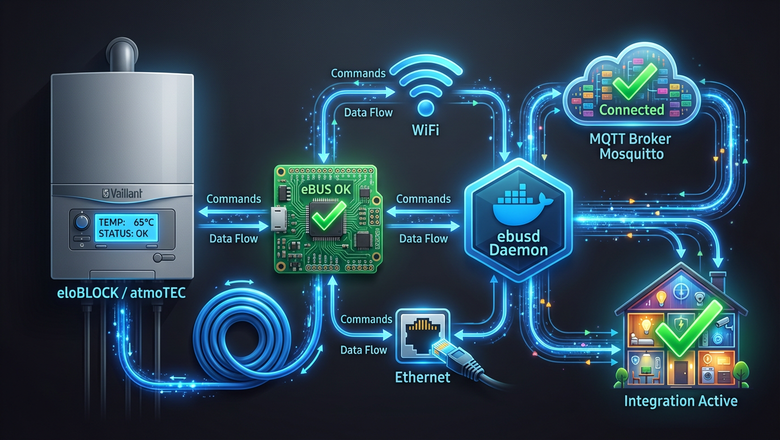
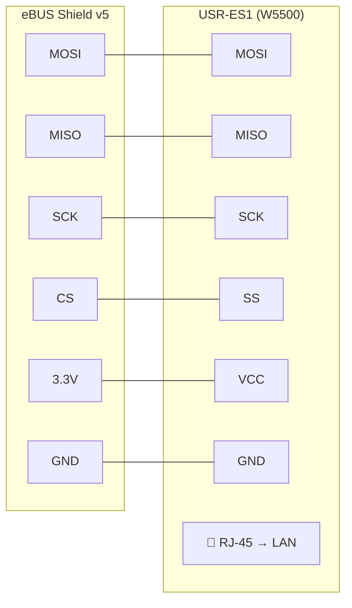
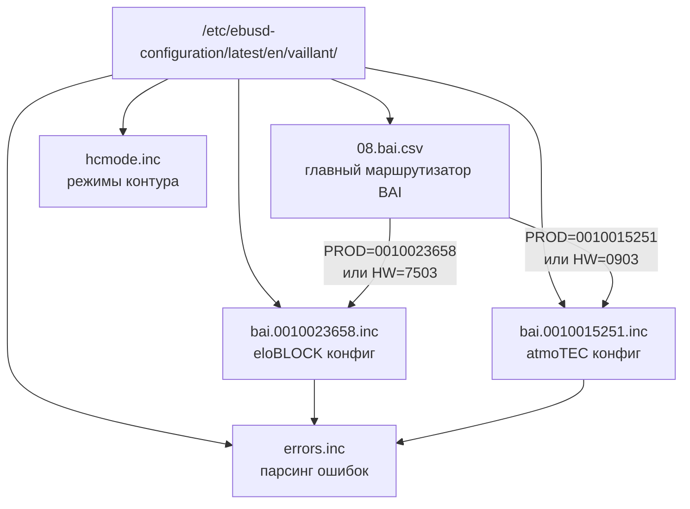
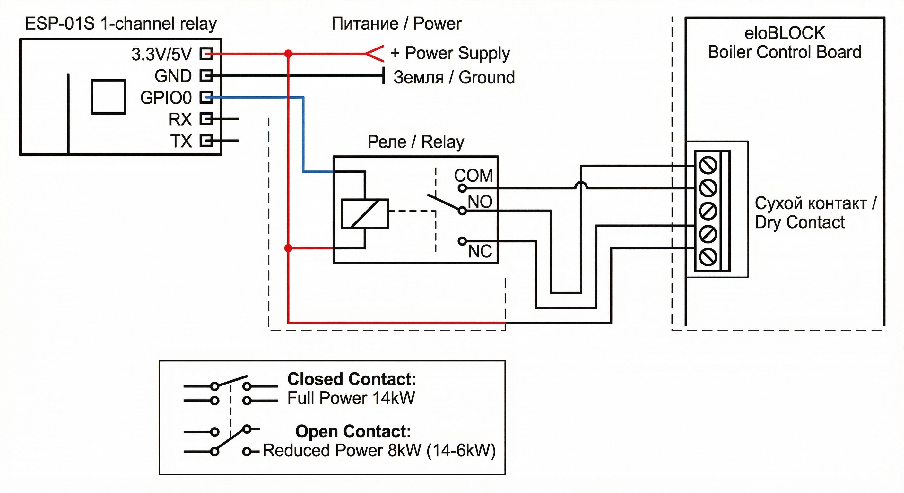
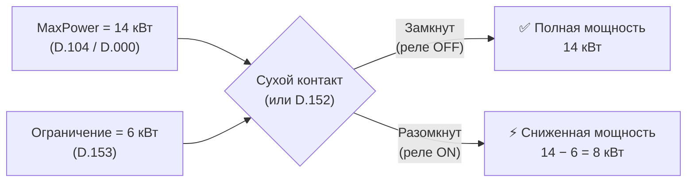
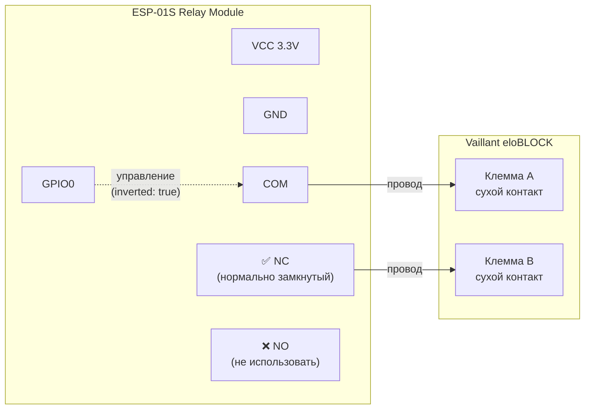
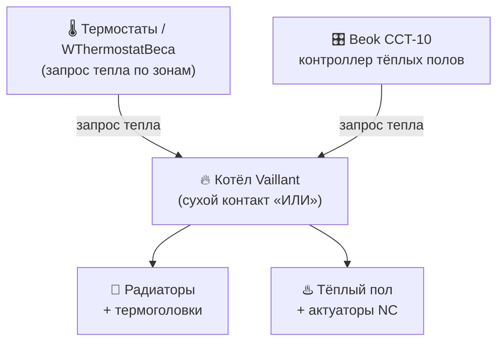
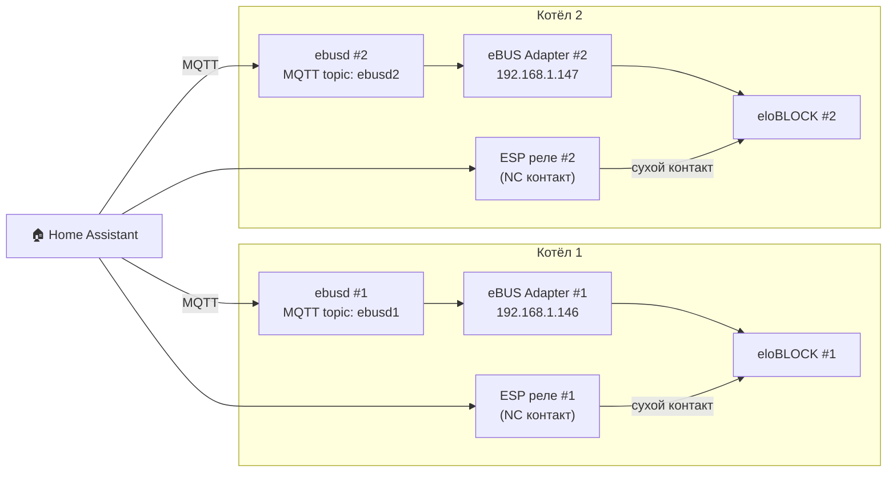

# Vaillant eloBLOCK и atmoTEC в умном доме: интеграция через eBUS, ebusd и Home Assistant

> **Аннотация:** Подробное руководство по подключению котлов Vaillant (электрического eloBLOCK и газового atmoTEC) к Home Assistant через протокол eBUS, демон ebusd и MQTT. Разбираем аппаратную часть, конфигурационные файлы, управление мощностью и автоматизацию отопления.

---

## Содержание

1. [Зачем всё это нужно?](#зачем)
2. [Архитектура решения](#архитектура)
3. [Аппаратная часть: адаптер eBUS](#адаптер)
4. [Установка и настройка ebusd](#ebusd)
5. [Конфигурационные файлы: как это работает](#конфиги)
6. [Котёл Vaillant eloBLOCK: электрические особенности](#eloblock)
7. [Котёл Vaillant atmoTEC: газовые особенности](#atmotec)
8. [MQTT и интеграция с Home Assistant](#mqtt)
9. [Управление мощностью через сухой контакт + ESPHome](#мощность)
10. [Автоматизация отопления](#автоматизация)
11. [Каскадное подключение котлов](#каскад)
12. [Диагностика ошибок](#диагностика)
13. [Итоги и планы](#итоги)

---

## 1. Зачем всё это нужно? {#зачем}

Современные котлы Vaillant оснащены цифровой шиной **eBUS** — проприетарным протоколом Vaillant Group, позволяющим обмениваться данными между котлом, терморегуляторами и внешними системами. По этой шине можно не только читать десятки параметров (температуры, давление, ступени мощности, часы наработки), но и записывать настройки — менять уставки температуры, включать/выключать режимы.

**Что даёт интеграция с умным домом:**

- Мониторинг в реальном времени: температура теплоносителя, давление в системе, потребляемая мощность
- Графики потребления энергии в Home Assistant Energy Dashboard
- Управление расписанием отопления через автоматизации
- Ограничение потребляемой мощности при пиковой нагрузке
- Push-уведомления при ошибках и аварийных ситуациях
- Экономия на отоплении: ночной нагрев по дешёвому тарифу

---

## 2. Архитектура решения {#архитектура}




**Компоненты:**

| Компонент | Назначение | Вариант |
|-----------|-----------|---------|
| **eBUS Adapter** | Физическое подключение к шине | Shield v5, v5-c6 |
| **USR-ES1** | Ethernet-модуль для адаптера | Опционально |
| **ebusd** | Демон для декодирования eBUS | Docker / HASSio addon |
| **MQTT broker** | Шина сообщений | Mosquitto |
| **Home Assistant** | Умный дом | HASS / HASSio |

---

## 3. Аппаратная часть: адаптер eBUS {#адаптер}

### Выбор адаптера

Рекомендуемый вариант — **[eBUS Adapter Shield v5](https://adapter.ebusd.eu/v5/index.en.html)** (или v5-c6). Это компактная плата (37×26 мм) с:
- Полной гальванической изоляцией
- Нулевым потреблением от шины eBUS
- Поддержкой WiFi (встроенная антенна), USB, GPIO и Ethernet
- OTA-обновлением прошивки

> 💡 **Почему v5?** В отличие от USB-адаптеров, сетевое подключение (WiFi/Ethernet) устраняет задержки USB-драйверов и джиттер, критичные для синхронизации на eBUS.

### Подключение к котлу

Шина eBUS — это два провода, полярность **не имеет значения**. Подключаться можно в любой точке цепи параллельно другим устройствам (термостатам, модулям расширения).


### Модуль USR-ES1 (опционально)

Для подключения Shield v5 по Ethernet используется модуль **USR-ES1** (W5500-совместимый). Он снижает задержки по сравнению с WiFi, что особенно важно при нестабильном WiFi-соединении.

**Схема подключения USR-ES1 к Shield v5:**



---

## 4. Установка и настройка ebusd {#ebusd}

### Вариант 1: Docker Compose (рекомендуется)

```yaml
# docker-compose.yml
services:
  ebusd:
    image: john30/ebusd
    container_name: ebusd
    restart: unless-stopped
    volumes:
      - './config/ebusd:/etc/ebusd'
      - './config/ebusd-configuration:/etc/ebusd-configuration'
    ports:
      - 8888:8888
    environment:
      # Адрес вашего eBUS-адаптера (префикс "ens:" = enhanced protocol)
      EBUSD_DEVICE: "ens:192.168.1.146:9999"
      EBUSD_LATENCY: 10
      EBUSD_CONFIGPATH: "/etc/ebusd-configuration/latest/en/"
      EBUSD_SCANCONFIG: "full"
      EBUSD_POLLINTERVAL: 30
      EBUSD_ACCESSLEVEL: "*"
      EBUSD_LOG: "all:notice"
      # MQTT
      EBUSD_MQTTHOST: "192.168.1.10"
      EBUSD_MQTTPORT: 1883
      EBUSD_MQTTCLIENTID: "ebusd"
      EBUSD_MQTTUSER: "your_user"
      EBUSD_MQTTPASS: "your_password"
      EBUSD_MQTTTOPIC: "ebusd"
      EBUSD_MQTTINT: "/etc/ebusd/mqtt-hassio.cfg"
      EBUSD_MQTTJSON: ""
```

### Вариант 2: HASSio addon

Установить через: `Supervisor → Add-on Store → репозиторий LukasGrebe/ha-addons`

Конфигурационный файл addon (`ebusd.txt`):

```ini
scanconfig: true
loglevel_all: notice
mqtttopic: ebusd
mqttint: /config/ebusd/mqtt-hassio.cfg
mqttjson: true
scan: full
network_device: 192.168.1.142:9999
mode: ens
latency: 15
acquireretries: 10
receivetimeout: 2500
sendretries: 5
scanretries: 10
accesslevel: "*"
```

### Конфигурационные файлы ebusd

После запуска ebusd автоматически скачивает конфигурации с CDN. Но для **кастомных котлов** (eloBLOCK, atmoTEC определённых версий прошивки) нужны свои `.inc` файлы.

**Структура папки конфигурации:**



---

## 5. Конфигурационные файлы: как это работает {#конфиги}


### Формат CSV-файлов ebusd

Каждая строка в `.inc` файле описывает один регистр котла:

```
тип, схема, имя, [комментарий], [QQ], ZZ, PBSB, [ID], поле, часть, тип_данных, делитель, единица, описание
```

**Пример:**
```csv
r,,FlowTemp,d.40 TFT_DK,,,,1800,,,tempsensor,,,flow temperature
```

- `r` — тип: чтение (read)
- `FlowTemp` — имя переменной в MQTT
- `1800` — адрес регистра (ID)
- `tempsensor` — тип данных (температурный датчик)

**Типы доступа:**

| Префикс | Значение |
|---------|---------|
| `r` | Только чтение |
| `r;w` | Чтение и запись |
| `r;wi` | Чтение + запись (install level) |
| `r;ws` | Чтение + запись (service level) |
| `r1` | Приоритетное чтение (poll priority 1) |

### Файл маршрутизации 08.bai.csv

```csv
[PROD='0010023658']!load,bai.0010023658.inc,,,
[PROD='0010015251']!load,bai.0010015251.inc,,,
# Fallback по hardware version (когда PROD scan не работает):
[HW=7503]!load,bai.0010023658.inc,,,
[HW=0903]!load,bai.0010015251.inc,,,
```

При старте ebusd сканирует шину, получает PROD/HW-код котла и загружает соответствующий `.inc` файл.

---

## 6. Котёл Vaillant eloBLOCK: электрические особенности {#eloblock}

### Модель: VE 14/18 кВт (PROD=0010023658, SW0109, HW7503)

eloBLOCK — это **электрический** котёл без газового тракта, вентилятора и CO-датчика. Поэтому в конфигурационном файле закомментированы все газоспецифичные параметры.

### Специфические параметры электрического котла

```csv
# ##### Параметры, специфичные для eloBLOCK #####

# Управление ступенями нагрева
r;wi,,HeatingStage1,d.100 Stage1 enable,,,,ED01,,,onoff,,,Heating element stage 1
r;wi,,HeatingStage2,d.101 Stage2 enable,,,,EE01,,,onoff,,,Heating element stage 2
r;wi,,HeatingStage3,d.102 Stage3 enable,,,,EF01,,,onoff,,,Heating element stage 3

# Активные ступени (битовая маска)
r,,ActiveStages,d.103 Stages active,,,,F001,,,UCH,,,Active stages bitmask

# Ограничение максимальной мощности (кВт, 1 байт UCH)
r;wi,,MaxPower,d.104 Max power,,,,A201,,,UCH,,kW,Power limit

# Суммарное потребление энергии (кВт·ч)
r,,TotalEnergy,d.105 Energy total,,,,B301,,,ULG,,kWh,Total energy consumption

# Текущая мощность (кВт, реальное время)
r,,CurrentPower,d.108 Power now,,,,E601,,,UIN,,kW,Current power output
```

### Таблица параметров eloBLOCK по уровням диагностики

| Параметр | Адрес | Тип | Описание | Статус |
|----------|-------|-----|---------|--------|
| `PartloadHcKW` | 6C00 | power | Частичная нагрузка CH | ✅ Работает |
| `FlowTemp` | 1800 | tempsensor | Температура подачи | ✅ Работает |
| `WP` | 4400 | onoff | Насос отопления | ✅ Работает |
| `HeatingDemand` | 4000 | yesno | Запрос тепла | ✅ Работает |
| `HeatingStage1-3` | ED01-EF01 | onoff | Ступени нагрева | ✅ Работает |
| `ActiveStages` | F001 | UCH | Активные ступени | ✅ Работает |
| `TotalEnergy` | B301 | ULG | Суммарная энергия | ✅ Работает |
| `MaxPower` | A201 | UCH | Макс. мощность | ✅ Работает |
| `CurrentPower` | E601 | UIN | Текущая мощность | ⚠️ Тип уточняется |
| `EBusHeatcontrol` | 0004 | — | Цифровой регулятор | ❌ Не применимо |
| `VortexFlowSensor` | D500 | — | Вихревой расходомер | ❌ Не применимо |
| `FlowSetPotmeter` | F003 | — | Потенциометр уставки | ❌ Не применимо |

---

## 7. Котёл Vaillant atmoTEC: газовые особенности {#atmotec}

### Модель: VUW (PROD=0010015251, SW0407, HW0903)

atmoTEC — атмосферный газовый котёл **без CO-датчика** (в отличие от atmoTEC PLUS). Поэтому все параметры группы `e.04–e.19` (SMGV, CO-концентрация, калибровка горелки) недоступны на этой версии прошивки и закомментированы.

### Ключевые параметры atmoTEC

```csv
# Температуры
r,,FlowTemp,d.40,,,,1800,,,tempsensor,,,flow temperature
r,,ReturnTemp,d.41,,,,9800,,,tempmirrorsensor,,,return temperature
r,,HwcTemp,d.03,,,,1600,,,tempsensor,,,DHW flow temperature
r,,StorageTemp,d.04,,,,1700,,,tempsensor,,,storage temperature

# Горелка
r,,Flame,Flame,,,,"0500",,,UCH,240=off;15=on,,flame signal
r,,IonisationVoltageLevel,d.44,,,,A400,,,SIN,10,,ionisation voltage

# ГВС
r,,HwcDemand,d.22,,,,5800,,,yesno,,,DHW demand
r,,HwcWaterflow,d.36,,,,5500,,,uin100,,,DHW flow rate

# Диагностика
r,,DeactivationsIFC,d.61,,,,1F00,,,UCH,,,ignition failures
r,,averageIgnitiontime,d.64,,,,2D00,,,UCH,10,s,average ignition time
```

### Параметры, недоступные на SW0407

Все ошибки типа `ERR: invalid position` в `ebusd_atmoTEC.log` относятся к:
- CO-сенсорным параметрам (`e.04–e.19`) — только для atmoTEC PLUS
- Калибровочным параметрам (`TTM_*`, `TTL_*`, `TTH_*`) — добавлены в более новых версиях SW
- Предиктивным параметрам для вентилятора (`Pred_FanPWM_*`) — SW0407 не поддерживает

---

## 8. MQTT и интеграция с Home Assistant {#mqtt}


### MQTT Discovery

Файл `mqtt-hassio.cfg` автоматически создаёт сущности в HA через механизм MQTT Discovery. После запуска ebusd в Home Assistant появятся устройства с параметрами котла.

**Ключевые настройки `mqtt-hassio.cfg`:**

```ini
# Автоматический опрос всех обнаруженных параметров (до 5 раз/мин)
filter-seen = 5

# Публиковать и читаемые, и записываемые параметры
filter-direction = r|u|^w

# Фильтр по уровню доступа (пустая строка = публичный уровень)
filter-level = ^$
```

### Структура топиков MQTT

После запуска ebusd публикует данные по схеме:
```
ebusd/bai/FlowTemp          → {"value": 65.5, "unit": "°C"}
ebusd/bai/HeatingDemand     → {"value": "yes"}
ebusd/bai/CurrentPower      → {"value": 12, "unit": "kW"}
ebusd/bai/HeatingSwitch/set ← "on" / "off"  (запись)
```

### Пример карточки в Home Assistant

```yaml
# Lovelace card для мониторинга котла
type: entities
title: Котёл Vaillant eloBLOCK
entities:
  - entity: sensor.ebusd_bai_flowtemp
    name: Температура подачи
  - entity: sensor.ebusd_bai_currentpower
    name: Текущая мощность
  - entity: sensor.ebusd_bai_activestages
    name: Активные ступени
  - entity: sensor.ebusd_bai_totalenergy
    name: Суммарное потребление
  - entity: switch.ebusd_bai_heatingswitch
    name: Режим отопления
```

### Добавление в Energy Dashboard

Параметр `TotalEnergy` (B301, тип ULG, единица kWh) идеально подходит для Energy Dashboard Home Assistant:

```yaml
# configuration.yaml
homeassistant:
  customize:
    sensor.ebusd_bai_totalenergy:
      device_class: energy
      state_class: total_increasing
      unit_of_measurement: kWh
```

---

## 9. Управление мощностью через сухой контакт + ESPHome {#мощность}

### Принцип работы



eloBLOCK имеет сухой контакт (клеммы котла) для ограничения мощности. При **замкнутом** контакте работает настроенная максимальная мощность. При **разомкнутом** — мощность снижается на заданное ограничение.



> ⚠️ При ограничении «по всем фазам» на котле 18 кВт ограничение кратно 6 кВт (6/12/18 кВт).

### Схема подключения ESP-01S

> ⚠️ **Важно:** используйте контакт **NC (нормально замкнутый)**, а не NO. При потере питания/перезагрузке ESP реле обесточивается — NC остаётся замкнутым, котёл продолжает работать на полной мощности. Это безопасное поведение по умолчанию.



**Логика работы:**

| Состояние реле | COM-NC | Мощность котла |
|---------------|--------|---------------|
| Выключено (ESP недоступен, default) | Замкнуто | **Полная** ✅ |
| Включено (команда из HA) | Разомкнуто | Снижена на D.153 кВт |

### ESPHome конфигурация

```yaml
# vaillant_power.yaml
substitutions:
  hostname: "vaillant_power"
  devicename: vaillant_power

esphome:
  name: ${devicename}

esp8266:
  board: esp01_1m

wifi:
  ssid: "your_ssid"
  password: "your_password"
  ap:
    ssid: "Vaillant Power Fallback"
    password: "your_secure_password"

switch:
  - platform: gpio
    pin: GPIO0
    name: "${devicename} switch"
    inverted: true  # реле NC-логика
```

### Автоматизация ограничения мощности

```yaml
# Снижаем мощность при включении стиральной машины
automation:
  - alias: "Ограничение мощности котла"
    trigger:
      - platform: state
        entity_id: sensor.washing_machine_power
        to: "on"
    action:
      - service: switch.turn_off
        target:
          entity_id: switch.vaillant_power_switch
      - delay: "00:30:00"  # 30 минут ограничения
      - service: switch.turn_on
        target:
          entity_id: switch.vaillant_power_switch
```

---

## 10. Автоматизация отопления {#автоматизация}

### Термостаты и актуаторы

**Рекомендуемая схема для зонального отопления:**



**Важно:** У котлов Vaillant **нет байпаса**. Хотя бы один радиатор должен быть открыт, пока работает котёл. Достигается программной калибровкой термостатических головок.

### Blueprint: Advanced Heating Control

Рекомендуем использовать готовый Blueprint от panhans:

```yaml
blueprint:
  source_url: >-
    https://github.com/panhans/HomeAssistant/blob/main/blueprints/automation/panhans/advanced_heating_control.yaml
```

**Логика автоматизации:**
- Ночной нагрев по льготному тарифу (ночная зона)
- Присутствие людей дома → активное отопление
- Отсутствие людей → режим экономии
- Тёплый пол отключается раньше радиаторов

---

## 11. Каскадное подключение котлов {#каскад}

При каскадировании двух eloBLOCK есть ограничения:



> ⚠️ Сухие контакты **нельзя соединять параллельно** — иначе ограничение применится к обоим котлам. Каждый котёл — отдельный адаптер, отдельный контейнер ebusd, отдельное реле.

```yaml
# docker-compose.yml для двух котлов
services:
  ebusd_boiler1:
    image: john30/ebusd
    container_name: ebusd_boiler1
    environment:
      EBUSD_DEVICE: "ens:192.168.1.146:9999"
      EBUSD_MQTTTOPIC: "ebusd1"
      ...

  ebusd_boiler2:
    image: john30/ebusd
    container_name: ebusd_boiler2
    environment:
      EBUSD_DEVICE: "ens:192.168.1.147:9999"
      EBUSD_MQTTTOPIC: "ebusd2"
      ...
```

---

## 12. Диагностика ошибок {#диагностика}

### ERR: invalid position

Самая частая ошибка в логах ebusd. Возникает когда:
- Регистр существует в конфиге, но **физически отсутствует** на данной версии котла/прошивки
- Котёл возвращает `00` (1 байт) вместо ожидаемых нескольких байт

**Решение:** закомментировать проблемный параметр в `.inc` файле. Смотрите готовые комментарии в файлах проекта.

### ERR: argument value out of valid range

Возникает для параметра `DCFTimeDate` когда к котлу не подключена DCF-антенна. Не критично — просто нет синхронизации времени по радиосигналу.

### Диагностические команды ebusctl

```bash
# Список всех обнаруженных устройств
ebusctl i

# Прочитать конкретный параметр
ebusctl read bai FlowTemp

# Записать параметр (например, включить зимний режим)
ebusctl write bai HeatingSwitch on

# Найти все параметры с ошибками
ebusctl find -r | grep ERR

# Получить текущее состояние всех параметров
ebusctl find -r -d
```

### Анализ логов

```bash
# Просмотр логов контейнера в реальном времени
docker logs -f ebusd

# Фильтрация ошибок
docker logs ebusd 2>&1 | grep "ERR:"

# Полный дамп сканирования шины
docker exec ebusd ebusctl i
```

---

## 13. Итоги и планы {#итоги}

### Что получилось

✅ **Работает стабильно:**
- Мониторинг 30+ параметров eloBLOCK в Home Assistant
- Управление режимами отопления (HeatingSwitch, HwcSwitch)
- Чтение ступеней мощности (HeatingStage1-3, ActiveStages)
- Суммарное потребление энергии (TotalEnergy) для Energy Dashboard
- Управление мощностью через ESP-01S реле

⚠️ **Требует уточнения / помощи сообщества:**
- Адреса eBUS для параметров **D.152** (фаза ограничения) и **D.153** (значение ограничения) — найдены в официальном мануале, но регистры eBUS неизвестны. Если их найти, можно управлять мощностью **без физического реле**!
- Формат параметра `CurrentPower` (E601) — UIN или UCH?
- Параметры `ElementHours` (C401) — корректность типа

❌ **Недоступно на данном hardware:**
- Параметры CO-датчика (atmoTEC без CO-сенсора)
- Предиктивная аналитика вентилятора (SW0407)
- VortexFlowSensor на eloBLOCK HW7503

### Находки из официального мануала Vaillant (0020265768_01)

В ходе исследования был обнаружен **официальный мануал по монтажу и обслуживанию eloBLOCK** (ManualsLib, 32 стр.), содержащий полную таблицу диагностических кодов D.xxx:

| Код | Параметр | Описание |
|-----|----------|---------|
| D.149 | Детализация ошибки F.075 | 0=OK, 1=насос заблокирован, 2=эл. неисправность, 3=сухой ход, 4=низкое напряжение, 5=датчик давления, 6=нет PWM |
| **D.152** | **Фаза ограничения мощности** | **0=нет, 1=фаза1, 2=фаза2, 3=фаза3, 4=все фазы — записываемый!** |
| **D.153** | **Уровень ограничения (кВт)** | **Вычитается из текущей мощности — записываемый!** |
| D.154 | Защита от замерзания | Активация/деактивация |
| D.155 | Текущая мощность (дисплей) | Непрерывно обновляется |
| D.093 | Вариант устройства | 0-7 = 6/9/12/14/18/21/24/28 кВт (насос HE); 8-15 = те же с 2-ступ. насосом |

> **Критическая находка:** параметры D.152 и D.153 — это программный аналог физического сухого контакта! Если удастся определить их eBUS-адреса, управление мощностью котла станет полностью программным, без ESP-01S и реле. Метод поиска: `ebusctl grab result all` до и после изменения D.152 на дисплее котла.

### Куда двигаться дальше

1. **Найти eBUS-адреса D.152/D.153** — метод: `ebusctl grab result all` до и после изменения параметра на дисплее котла. Это откроет возможность software power limiting
2. **Помочь с параметрами** — если у вас eloBLOCK или atmoTEC, поделитесь значениями неизвестных регистров через Issues
3. **Миграция на TypeSpec** — ebusd v24+ поддерживает новый формат конфигов `.tsp`
4. **Добавить hcmode** — управление режимами отопительного контура через B511 протокол

### Полезные ссылки

- 🐙 [Репозиторий проекта](https://github.com/Gfermoto/Vaillant)
- 📖 [ebusd wiki](https://github.com/john30/ebusd/wiki)
- 🔧 [ebusd-configuration](https://github.com/john30/ebusd-configuration)
- 📡 [eBUS Adapter Shield v5](https://adapter.ebusd.eu/v5/index.en.html)
- 🏠 [HASSio addon ebusd](https://github.com/LukasGrebe/ha-addons)
- 🌡️ [WThermostatBeca](https://github.com/fashberg/WThermostatBeca) — прошивка для термостатов Beca
- 🤖 [Advanced Heating Control Blueprint](https://github.com/panhans/HomeAssistant/blob/main/blueprints/automation/panhans/advanced_heating_control.yaml)

---

## Приложение: Схема регистров eloBLOCK по группам

```
Уровень диагностики 1 (d.00–d.47):
  d.00 PartloadHcKW    6C00  power    Частичная нагрузка CH
  d.01 WPPostrunTime   6400  minutes  Время выбега насоса
  d.04 StorageTemp     1700  temp     Температура накопителя
  d.05 FlowTempDesired 3900  temp     Уставка подачи
  d.10 WP              4400  on/off   Насос CH
  d.11 extWP           3F00  on/off   Внешний насос
  d.14 PumpPowerDesired A100  UCH     PWM насоса
  d.15 WPPWMPower      7300  UCH     Текущий PWM насоса
  d.16 DCRoomthermostat 0E00 on/off   Термостат 24В
  d.22 HwcDemand       5800  yes/no   Запрос ГВС
  d.23 HeatingDemand   4000  yes/no   Запрос отопления
  d.40 FlowTemp        1800  temp     Температура подачи
  d.47 OutdoorstempSensor 7600 temp   Уличная температура

Уровень диагностики 2 (d.60–d.96):
  d.60 DeactivationsTemplimiter 2000 UCH  Срабатывания STL
  d.71 FlowsetHcMax    A500  temp     Макс. уставка подачи
  d.76 CodingResistor  9200  HEX:3    Кодировочный резистор
  d.80 HcHours         2800  hours    Часы работы CH
  d.81 HwcHours        2200  hours    Часы работы ГВС
  d.82 HcStarts        2900  UIN      Циклов CH
  d.83 HwcStarts       2300  UIN      Циклов ГВС
  d.84 HoursTillService AC00 hours    До следующего ТО

Электрические параметры (d.100–d.108, eloBLOCK specific):
  d.100 HeatingStage1  ED01  on/off   Ступень нагрева 1
  d.101 HeatingStage2  EE01  on/off   Ступень нагрева 2
  d.102 HeatingStage3  EF01  on/off   Ступень нагрева 3
  d.103 ActiveStages   F001  UCH      Битмаска активных ступеней
  d.104 MaxPower       A201  UCH      Ограничение мощности (кВт)
  d.105 TotalEnergy    B301  ULG      Суммарное потребление (кВт·ч)
  d.106 ElementHours   C401  hours    Часы наработки ТЭНов
  d.107 OverTempStatus D501  temp     Защита от перегрева
  d.108 CurrentPower   E601  UIN      Текущая мощность (кВт)

Параметры из официального мануала D.149-D.155 (адреса eBUS не определены):
  d.149 PumpFaultDetail ????  UCH      Детализация ошибки F.075 насоса
  d.152 PowerLimiterPhase ??? UCH      Фаза ограничения (0=нет, 1-3=фазы, 4=все) ✍️
  d.153 PowerLimiterValue ??? UCH      Уровень ограничения мощности (кВт)       ✍️
  d.154 FrostProtection  ????  on/off   Защита от замерзания
  d.155 CurrentPowerDisplay ? UCH      Текущая мощность на дисплее (обновляется непрерывно)

  ✍️ = ЗАПИСЫВАЕМЫЙ параметр — программный аналог физического сухого контакта!
```

---

*Статья написана на основе личного опыта эксплуатации Vaillant eloBLOCK VE18 и atmoTEC plus. Буду рад обратной связи и pull requests в репозитории проекта.*
